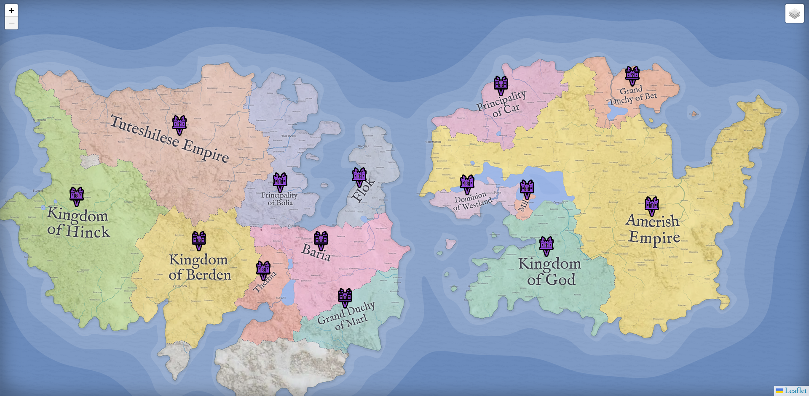
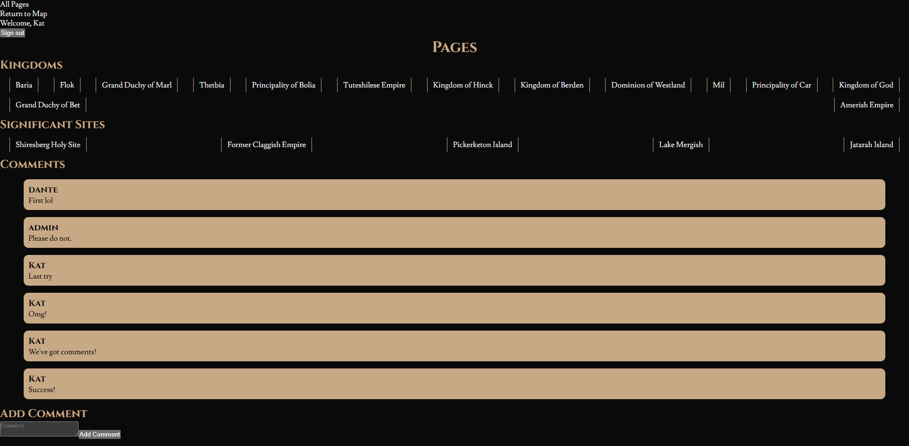

# Map of the Realm of Couly

 

## Description

## Table of Contents

- [Installation](#installation)
- [Usage](#usage)
- [Contributing](#contributing)
- [License](#license)

## Installation

Visit [https://realm-of-couly.vercel.app/](https://realm-of-couly.vercel.app/)

## Usage

Learn all about the fantasy realm of Couly!

## Contributing

This is a [Next.js](https://nextjs.org) project bootstrapped with [`create-next-app`](https://nextjs.org/docs/app/api-reference/cli/create-next-app).

- Typescript
- OAuth/NextAuth
- Leaflet
- Vercel

## License 

Licensed under None

## Tests

N/A